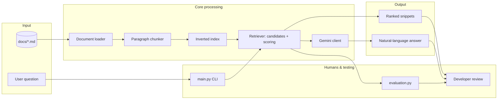

# DocuBot — Documentation Q&A (RAG Learning Lab)

## Original project context

This repository extends **DocuBot**, the **CodePath AI 110 “tinker” activity from Modules 1–3** (the applied documentation assistant lab). The original goal was to build intuition for **retrieval**, **indexing**, and **retrieval-augmented generation (RAG)** by comparing three approaches: asking an LLM without retrieval, returning evidence snippets only, and combining retrieval with an LLM grounded on snippets. The starter project uses plain Markdown docs (API, auth, database, setup) so you can experiment without running a real backend.

## Title and summary

**DocuBot** is a small system that answers developer-style questions about a **local documentation corpus**. It matters because it demonstrates a practical pattern for **grounding** language models: first **find** the right evidence, then **generate** an answer with explicit constraints, instead of relying on the model’s memory alone.

## Architecture overview

The system has three logical layers: **corpus + chunking**, **retrieval**, and **generation** (optional). A separate **evaluation** script scores retrieval quality against simple “expected file” rules. Humans stay in the loop by choosing a mode in the CLI, reading outputs, and interpreting hit rates.

### System diagram




**Data flow (input → process → output):**

1. **Input:** questions (typed or from `dataset.py` sample queries) plus Markdown/text files under `docs/`.
2. **Process:** load files → split into paragraph chunks → build a lightweight inverted index → retrieve top snippets via token overlap scoring (with stop-word filtering).
3. **Output:** either **snippets only** (retrieval mode) or a **Gemini answer** constrained to those snippets (RAG mode). A **naive LLM** mode sends the question to Gemini without attaching the corpus in the current prompt implementation (useful as a contrast point for the activity).

**Where humans and testing fit in:**

- **Humans:** run `main.py`, choose a mode, and judge whether answers are faithful to the docs; adjust prompts, scoring, or queries based on failure cases.
- **Automated testing:** `python -m pytest tests/` runs golden retrieval checks (no API key), and `evaluation.py` reports a **hit rate** over `SAMPLE_QUERIES` using `EXPECTED_SOURCES`.

**Web app (M0–M1):** `web/` is a **Next.js** UI plus **retrieval-only** API (`POST /api/retrieve`) that mirrors the Python scoring logic in TypeScript. The bundled corpus lives under `web/content/docs` (kept in sync with the repo `docs/` Markdown files). Operational defaults and limits are documented under `web-spec/`. CI runs `**npm run test`**, `**npm run lint`**, and `**npm run build**` in `web/` (see `.github/workflows/docubot-web-ci.yml`).

## Setup instructions

### Python CLI (primary)

1. Install dependencies:
  ```bash
   pip install -r requirements.txt
  ```
2. Copy environment template and add your key (needed for LLM modes **1** and **3**):
  ```bash
   cp .env.example .env
  ```
   Set `GEMINI_API_KEY=your_key_here` inside `.env`.
3. Run the CLI:
  ```bash
   python main.py
  ```
4. Choose a mode:
  - **1:** Naive LLM (Gemini; no retrieval in the prompt path as implemented in `llm_client.py`)
  - **2:** Retrieval only (no API key required)
  - **3:** RAG (retrieve snippets, then Gemini answers using only those snippets)

### Automated retrieval tests (optional, no API key)

Run these from the **repository root** (the folder that contains `requirements-dev.txt`, `docubot.py`, and `tests/`), not from `web/`.

```bash
cd path/to/applied-ai-system-project-docubot
python -m pip install -r requirements-dev.txt
python -m pytest tests/ -v
```

On Windows, if `python` is not on your PATH, use `py -3` instead (for example `py -3 -m pip install …` and `py -3 -m pytest …`).

### Retrieval evaluation (optional)

```bash
python evaluation.py
```

### DocuBot Web (Next.js)

```bash
cd web
npm install
npm run test
npm run dev
```

- UI: `http://localhost:3000` — ask questions and inspect ranked snippets.
- Health: `GET http://localhost:3000/api/health`
- Retrieve: `POST http://localhost:3000/api/retrieve` with JSON body `{ "query": "…", "topK": 5 }`

Bundled docs ship in `web/content/docs`. To refresh from the Python corpus, copy `docs/*.md` into that folder.

## Sample interactions

Below are realistic examples based on the bundled `docs/` corpus and retrieval behavior.

### 1) Retrieval-only (Mode 2)

- **Input:** “Where is the auth token generated?”
- **Output (shape):** Top snippets from `AUTH.md` (and sometimes `API_REFERENCE.md` when wording overlaps), showing the paragraph that names `generate_access_token` in `auth_utils.py` and the role of `AUTH_SECRET_KEY`.

### 2) RAG (Mode 3)

- **Input:** “What environment variables are required for authentication?”
- **Output (shape):** A short Gemini answer that cites `AUTH.md` / `SETUP.md`, listing variables such as `AUTH_SECRET_KEY` and `TOKEN_LIFETIME_SECONDS`, and refusing if snippets lack evidence.

### 3) Failure case (why evaluation matters)

- **Input:** “How does a client refresh an access token?”
- **What can go wrong:** Lexical retrieval may surface `API_REFERENCE.md` hits first if query terms match route listings strongly; `evaluation.py` may mark this as a **miss** even though a human might still find the answer elsewhere in the corpus.
- **Takeaway:** simple bag-of-words retrieval is a **baseline**, not a complete search product.

## Design decisions

- **Paragraph chunks instead of whole files:** smaller units improve precision for short factual questions and keep LLM context windows focused.
- **Inverted index + overlap scoring:** easy to teach and fast for small corpora; trades away semantic understanding (no embeddings) for transparency and debuggability.
- **Stop-word filtering:** reduces score inflation from generic language shared across many sections.
- **RAG prompt rules:** the Gemini prompt requires sticking to snippets and a verbatim “I do not know…” refusal to reduce confident hallucinations.
- **Evaluator simplicity:** `EXPECTED_SOURCES` uses substring keys to approximate “correct” files so students can track progress without building a full IR test harness.

## Testing summary

**Proof (one line):** **5 / 5** `python -m pytest tests/` checks passed; the `evaluation.py` harness labels **5 / 8** sample queries as hits (~0.62); the stack did best on keyword‑specific questions and worst when **API vs auth docs shared vocabulary**; **off‑topic** questions return **no snippets** plus an “I do not know” style retrieval-only answer (no model in those tests).

**How reliability is measured**

- **Automated tests:** `python -m pytest tests/` — golden retrieval cases (auth token → `AUTH.md`, users table → `DATABASE.md`, payment → empty), refusal text when there is no evidence, and a floor on `evaluation.py` hit rate (regressions fail in CI).
- **Harness metric:** `python evaluation.py` — reports per-query hits against `EXPECTED_SOURCES` in `evaluation.py`.
- **Human / peer review:** run `main.py` mode **2** or **3** and confirm answers match cited snippets (especially after changing prompts or scoring).

```bash
# From repo root (folder containing requirements-dev.txt)
python -m pip install -r requirements-dev.txt
python -m pytest tests/ -v
python evaluation.py
```

- **Retrieval evaluation:** running `python evaluation.py` on the current code and `docs/` produced a **hit rate of 0.62** (5 / 8 sample queries matched the harness’s expected filenames in the top results). Strong matches included database connection questions and several auth and user-listing queries.
- **What worked:** straightforward questions with distinctive keywords (for example database setup, explicit endpoint phrasing) tended to retrieve the right file quickly.
- **What did not:** some queries with overlapping vocabulary across multiple docs (for example refresh-token wording competing with general API route lists) surfaced the wrong top file; the **payment processing** query correctly retrieved **no** snippets, illustrating the “no evidence” path.
- **What I learned:** lexical retrieval is sensitive to **wording** and **document structure**; evaluation metrics depend heavily on how “expected” labels are defined.

## Reflection

This project reinforced that **retrieval and generation are separate concerns**: retrieval quality sets a ceiling on RAG trustworthiness. Building the index and scoring logic demanded careful thinking about **data structures** and **normalization** (tokens, punctuation, stop words). Using both **automated checks** and **human reading** helped catch cases where metrics and user satisfaction diverge. Overall, it clarified how small, inspectable systems can teach RAG end-to-end before jumping to embedding databases and production-scale observability.