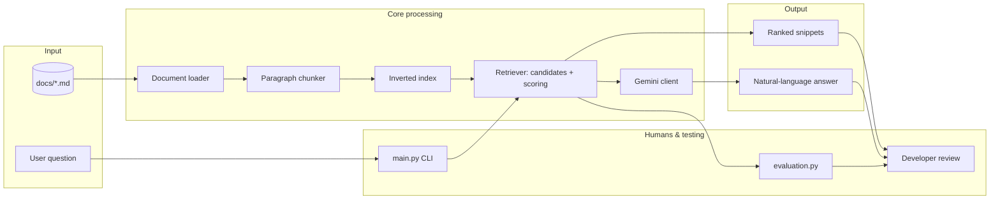

# DocuBot - Documentation Q&A (RAG Learning Lab)

## Original project context

This repository extends **DocuBot**, the CodePath AI 110 lab from Modules 1-3.  
The goal is to learn **retrieval**, **indexing**, and **RAG** by comparing three modes: LLM-only, retrieval-only, and RAG.  
The project uses local Markdown docs (`docs/`) so you can test ideas without a real backend.

## Title and summary

**DocuBot** answers developer-style questions from a local docs set.  
It shows a practical pattern: **retrieve evidence first, then generate** an answer.

## Architecture overview

The system has three parts: **corpus + chunking**, **retrieval**, and optional **generation**.  
A separate script (`evaluation.py`) checks retrieval quality against simple expected-source rules.  
People stay in the loop by running the CLI and checking whether answers match the docs.

### System diagram




**Data flow (input -> process -> output):**

1. **Input:** questions (typed or from `dataset.py` sample queries) plus Markdown/text files under `docs/`.
2. **Process:** load files -> split into paragraph chunks -> build a lightweight inverted index -> retrieve top snippets using token overlap (with stop-word filtering).
3. **Output:** either **snippets only** (retrieval mode) or a **Gemini answer** that must use retrieved snippets (RAG mode).  
   In naive mode, the current prompt path asks Gemini without attaching corpus text.

**Where humans and testing fit in:**

- **Humans:** run `main.py`, choose a mode, and check whether answers match the docs.
- **Automated testing:** `python -m pytest tests/` runs golden retrieval checks (no API key).  
  `evaluation.py` reports a hit rate over `SAMPLE_QUERIES` using `EXPECTED_SOURCES`.

- Next.js UI
- Retrieval-only API (`POST /api/retrieve`)
- TypeScript retrieval logic that mirrors Python behavior

Bundled docs for the web app are in `web/content/docs`.

Operational limits and guardrails are in `web-spec/`.

CI for `web/` runs:

- `npm run test`
- `npm run lint`
- `npm run build`

See `.github/workflows/docubot-web-ci.yml`.

## Setup instructions

### Python CLI (primary)

1. Install dependencies:

```bash
pip install -r requirements.txt
```

2. Copy env template:

```bash
cp .env.example .env
```

3. Set your Gemini key in `.env` (needed for modes 1 and 3):

```env
GEMINI_API_KEY=your_key_here
```

4. Run the CLI:

```bash
python main.py
```

5. Choose a mode:

- **1:** Naive LLM
- **2:** Retrieval only
- **3:** RAG

### Automated retrieval tests (optional, no API key)

Run these from the **repository root** (the folder that contains `requirements-dev.txt`, `docubot.py`, and `tests/`), not from `web/`.

```bash
cd path/to/applied-ai-system-project-docubot
python -m pip install -r requirements-dev.txt
python -m pytest tests/ -v
```

On Windows, if `python` is not on your PATH, use `py -3` (for example `py -3 -m pip install ...` and `py -3 -m pytest ...`).

### Retrieval evaluation (optional)

```bash
python evaluation.py
```

### DocuBot Web (Next.js)

```bash
cd web
npm install
npm run test
npm run dev
```

- UI: `http://localhost:3000` - ask questions and inspect ranked snippets.
- Health: `GET http://localhost:3000/api/health`
- Retrieve: `POST http://localhost:3000/api/retrieve` with JSON body `{ "query": "How do I connect to the database?", "topK": 5 }`

Bundled docs ship in `web/content/docs`. To refresh from the Python corpus, copy `docs/*.md` into that folder.

## Sample interactions

Below are realistic examples based on the bundled `docs/` corpus and retrieval behavior.

### 1) Retrieval-only (Mode 2)

- **Input:** "Where is the auth token generated?"
- **Output (shape):** Top snippets from `AUTH.md` (and sometimes `API_REFERENCE.md` if wording overlaps), including `generate_access_token` and `AUTH_SECRET_KEY`.

### 2) RAG (Mode 3)

- **Input:** "What environment variables are required for authentication?"
- **Output (shape):** A short Gemini answer that cites `AUTH.md` and `SETUP.md`, lists variables like `AUTH_SECRET_KEY` and `TOKEN_LIFETIME_SECONDS`, and refuses when evidence is missing.

### 3) Failure case (why evaluation matters)

- **Input:** "How does a client refresh an access token?"
- **What can go wrong:** Lexical retrieval may rank `API_REFERENCE.md` too high when route terms overlap.  
  `evaluation.py` may mark this as a miss even when a person can still find the answer in another file.
- **Takeaway:** simple bag-of-words retrieval is a baseline, not a full search system.

## Design decisions

- **Paragraph chunks instead of whole files:** smaller units improve precision for short factual questions and keep LLM context windows focused.
- **Inverted index + overlap scoring:** easy to teach and fast for small corpora, but weaker on semantic matching (no embeddings).
- **Stop-word filtering:** reduces score inflation from generic language shared across many sections.
- **RAG prompt rules:** Gemini must stick to snippets and use an explicit refusal when evidence is not enough.
- **Simple evaluator:** `EXPECTED_SOURCES` uses substring keys so students can track progress without a large IR test harness.

## Testing summary

**Proof (one line):** **5 / 5** `pytest` checks passed.  
`evaluation.py` reports **5 / 8** hits (~0.62).  
It works best on specific keywords and struggles when API/auth wording overlaps.  
Off-topic questions return no snippets and a refusal-style retrieval answer.

**How reliability is measured**

- **Automated tests:** `python -m pytest tests/` checks golden retrieval cases and refusal behavior.  
  It also enforces a minimum hit-rate floor so regressions fail in CI.
- **Harness metric:** `python evaluation.py` reports per-query hits against `EXPECTED_SOURCES` in `evaluation.py`.
- **Human / peer review:** run `main.py` mode **2** or **3** and confirm answers match cited snippets.

```bash
# From repo root (folder containing requirements-dev.txt)
python -m pip install -r requirements-dev.txt
python -m pytest tests/ -v
python evaluation.py
```

- **Retrieval evaluation:** `python evaluation.py` currently reports a **0.62** hit rate (5 / 8 queries).
- **What worked:** straightforward questions with clear keywords often retrieved the right file.
- **What did not:** queries with overlapping vocabulary sometimes ranked the wrong file first.  
  The payment-processing query correctly returned no snippets.
- **What I learned:** lexical retrieval is sensitive to wording and document structure.  
  Evaluation numbers also depend on how expected labels are defined.

## Reflection

### What are the limitations or biases in your system?
- One bias is answers are only as fair and complete as the markdown that is currently in the 'docs/'. Gaps, outdated API notes, or one-sided explanations become the truth for RAG. So it's important to make sure the docs provided are of high quality and updated. A way to nullify this flaw is to just omit the local docs, and ask the AI/model to find external documetations on website and answer the user's questions that way.

### Could your AI be misused, and how would you prevent that?
- A case of misuse would be treating DocuBot as a authoritative security or compliance advice. Also have to be careful of leaking internal docs if someone points Docubout at sensitive  files.

### What surprised you while testing your AI's reliability?
- Hit rate isn't exactly the only factor when trying to guage how useful a response is to the user. Also the retrieval can look "smart" of easy queries and also when Docubot failes when several docs share the same vocabulary (e.g. auth vs API  reference both mentioning  tokens and routes).

### describe your collaboration with AI during this project. Identify one instance when the AI gave a helpful suggestion and one instance where its suggestion was flawed or incorrect.
- AI was usefil while in the planning phase of the upgraded Docubot (e.g. edge cases and defining scope of the project). Something AI wasn't useful for is over-engineering such as jumping into embeddings and Vector DB before th simple  index works. This would add complexity to the project and hide bugs in the chunking and evaluation.

